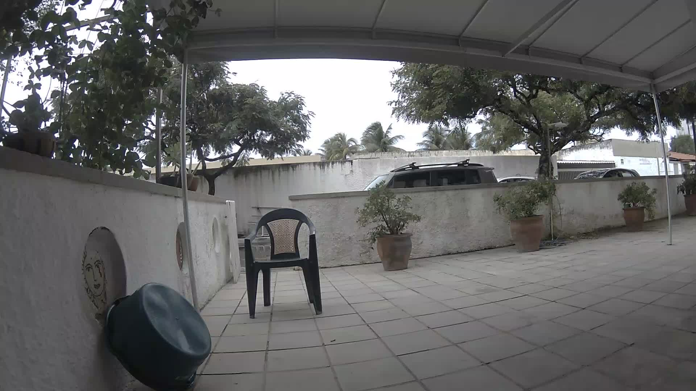
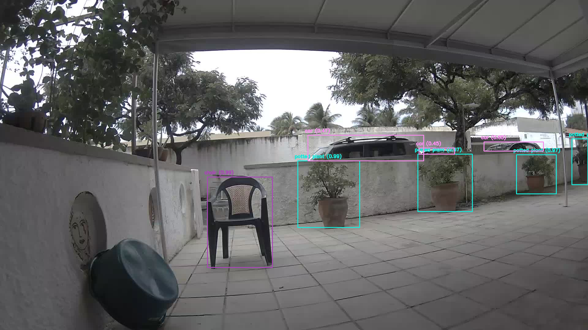

# Detecting Custom Objects on a Meraki MV Camera
Artificial Intelligence can unlock new methods of how enterprises engage with their customers, their products, and their physical spaces. Being able to detect different categories of objects may be instrumental for organizations to be successful.

Machine Learning (ML) techniques can be applied to detect objects on images based on triggers such as motion detection. 
Practical applications can be: anomaly detection in manufacturing, customer engagement in retail or object counting in a public facility.

Data governance, privacy and cost concerns can be impeditive for organizations to use public cloud object detection API’s, such as AWS Rekognition or Google AutoML. Also, some applications require the flexibility to train systems to identify customized classes of objects, while utilizing resources owned by the organization.
The workshop will introduce the foundational knowledge of ML applied to object detection. We will use publicly licensed projects such as the You Only Look Once (YOLO) recognition system and the COCO dataset, a large-scale classification collection.

#### Sample Input 
 

#### Sample Output



#### Requirements
##### Hardware
- A licensed Meraki MV camera;

##### Authorization
- An API Key;

##### Network information
- The Network ID of a Meraki Dashboard network that has at least one camera;

##### Trained Model
- The first thing the script will do is to download the trained Machine Learning model (called weigths) to a local folder.


##### Required libraries

To easily install or upgrade to the latest release, use [pip](http://www.pip-installer.org/).

```shell
pip install -r requirements.txt
```


#### Configuring the app
##### Variables 
This program uses 2 mandatory and 1 optional arguments:
1) API_KEY - Mandatory - [Documentation](https://documentation.meraki.com/zGeneral_Administration/Other_Topics/The_Cisco_Meraki_Dashboard_API) on how to obtain an API Key 
2) NETWORK_ID - Mandatory - [Guide](https://community.cisco.com/t5/mobility-blogs/dashboard-apis-optimizing-your-daily-workflow/ba-p/3659433) on how to obtain your Network id
3) CAMERAS - Optional - If you don't want all cameras on your network to be scanned, you can create a string that contains a series
    of Serial Numbers separated by ;


There are 3 ways you can set the variables:
1) config.ini
 
Create a file at the root called config.ini with the following structure: 

```shell
[meraki]
API_KEY=6B2u7njMl8G0VA8KJfRlPKMiY6tf6Cd1paPIrjtL
NETWORK_ID=L_689553880529869765
CAMERAS=Q2EV-43C3-BZVX;Q2HV-43C3-BZVP
RTSP=Q2EV-43C3-BZVX
```
2) Environment variables

Export API_KEY, NETWORK_ID and CAMERAS as env variables.
```shell
export API_KEY=6B2u7njMl8G0VA8KJfRlPKMiY6tf6Cd1paPIrjtL
export NETWORK_ID=L_689553880529869765
export CAMERAS=Q2EV-43C3-BZVX;Q2HV-43C3-BZVP
export RTSP=Q2EV-43C3-BZVX
```

3) Hard code (not recommended)

API_KEY, NETWORK_ID and CAMERAS on the python file itself. The Meraki API Key gives access to your Meraki organization and putting it out there in the wild can be dangerous.


## What does this code do?
### Step 1
Uses one of the provided images to run the YOLOv3 model. 


### Step 2
1) Create necessary directories;
2) Connect to Meraki;
3) Get a list of Meraki Cameras;
4) For each camera:
    
    4.1) Downloads a snapshot of the current field of view of the camera;
    
    4.2) Runs a YOLOv3 model previously trained on the COCO dataset and stores the image locally. 
    

If you like this code or if you have any questions, feel free to reach out:

[LinkedIn](http://linkedin.com/in/rafaelloureirodecarvalho/?locale=en_US)